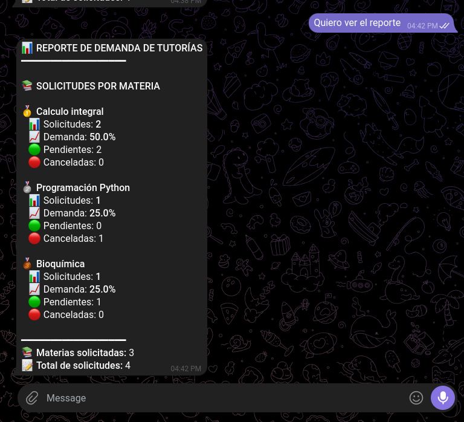
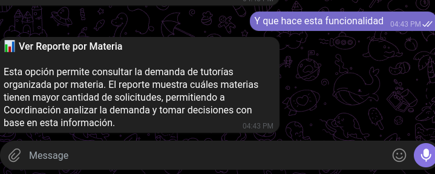
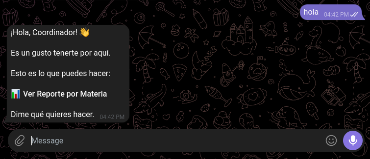
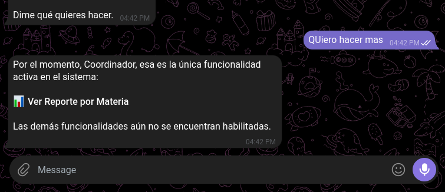
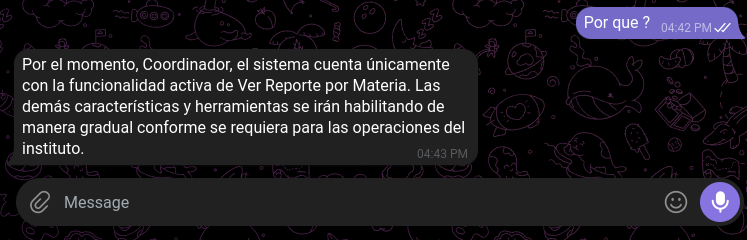

# 📊 Módulo de Coordinación Académica — Complemento de `CHAT_BOT.zip`

> 📁 Repositorio: **[Chatbot-de-Asesorias-Yisus](https://github.com/tecnicajesus20-code/Chatbot-de-Asesorias-Yisus.git)**

Este proyecto es una **extensión** del sistema de asesorías académicas construido en `CHAT_BOT.zip`, contenido dentro del repositorio [`Chatbot-de-Asesorias-Yisus`](https://github.com/tecnicajesus20-code/Chatbot-de-Asesorias-Yisus.git). Mientras que el sistema base atiende a los **estudiantes** (agendar, cancelar y consultar tutorías vía Telegram), este complemento añade un **bot para el Coordinador Académico**, orientado a la analítica y toma de decisiones sobre la demanda de tutorías.

Está construido sobre **n8n** (automatización de flujos), **Telegram Bot API** (interfaz conversacional) y **Google Sheets** (base de datos), con un **Agente de IA (Google Gemini)** como motor conversacional.

---

## 🧩 ¿Qué añade este complemento?

| Workflow (n8n)             | Rol                                                                                  |
|-----------------------------|---------------------------------------------------------------------------------------|
| `Cordinacion_bot.json`      | Bot de Telegram con Agente de IA que atiende al **Coordinador Académico**.           |
| `Reporte_por_Materias.json` | Webhook que cruza tutores + tutorías asignadas y genera el **Reporte de Demanda por Materia**. |

A diferencia del bot de estudiantes (`MasterMind_Bot`), este bot **no gestiona citas**: su propósito actual es exclusivamente informativo/analítico para Coordinación, con la posibilidad de habilitar más funciones a futuro (el propio agente está diseñado para anunciar solo las funciones activas).

---

## 🏗️ Arquitectura general del sistema

```
┌─────────────────────┐        ┌──────────────────────┐
│   Estudiante         │        │   Coordinador Académico│
│   (Telegram)         │        │   (Telegram)          │
└──────────┬───────────┘        └───────────┬───────────┘
           │                                 │
           ▼                                 ▼
   ┌───────────────┐                 ┌───────────────────┐
   │ MasterMind_Bot │                 │  Cordinacion_bot   │
   │  (CHAT_BOT.zip)│                 │  (este complemento)│
   └───────┬────────┘                 └─────────┬──────────┘
           │  AI Agent + Gemini                  │ AI Agent + Gemini
           │  (Simple Memory por chatId)          │ (Simple Memory por chatId)
           │                                      │
   ┌───────▼─────────────────────┐        ┌───────▼─────────────────┐
   │ Sub-workflows (herramientas)│        │ Reporte_por_Materias      │
   │ - ValidarEstudiante         │        │ (webhook: ReportePorMateria)│
   │ - VerMaterias               │        └───────┬───────────────────┘
   │ - ConsultarDisponibilidad   │                │
   │ - AgendarCita                │                │
   │ - CancelarCita                │                │
   │ - ConsultarCitasPendientes   │                │
   └───────┬─────────────────────┘                │
           │                                       │
           ▼                                       ▼
   ┌───────────────────────────────────────────────────────┐
   │           Google Sheets: DataBase_Chatbot.xlsx          │
   │  estudiantes_informacion · tutores_informacion           │
   │  disponibilidad_tutores · Tutorias_asignadas             │
   │  Gestion_de_chat · Sessiones                              │
   └───────────────────────────────────────────────────────┘
```

Ambos bots comparten la **misma base de datos** en Google Sheets, pero cada uno interactúa con ella a través de sus propios webhooks/herramientas.

---

## 🤖 Flujo del bot de Coordinación (`Cordinacion_bot.json`)

1. **`Telegram Trigger`** — escucha mensajes entrantes del Coordinador.
2. **`AI Agent`** (Gemini `models/gemini-3.5-flash-lite`) — interpreta la intención del Coordinador según un prompt de sistema que define:
   - Saludo y menú inicial (solo muestra las opciones activas, sin explicarlas).
   - Explicación de "Ver Reporte por Materia" **solo si se pregunta explícitamente**.
   - Ejecución directa de la herramienta si la solicitud del reporte es clara (sin pedir confirmación).
   - Respuesta fija `"Mensaje enviado"` tras ejecutar la herramienta con éxito (no repite ni interpreta el contenido del reporte, ya que este se envía por separado).
   - Mensaje estándar cuando se solicita una funcionalidad no habilitada.
3. **`Simple Memory`** — memoria de conversación por `chatId`, ventana de 15 mensajes.
4. **`VerReporteporMateria`** (herramienta HTTP) — invoca el webhook `ReportePorMateria`.
5. **`If`** — evalúa si la respuesta del agente es distinta de `"Mensaje enviado"` para decidir si reenviarla al Coordinador (evita duplicar el mensaje del reporte, que ya lo envía el propio workflow del reporte).
6. **`Send a text message`** — responde al Coordinador por Telegram.

## 📈 Flujo del reporte (`Reporte_por_Materias.json`)

1. **`Webhook`** (`/ReportePorMateria`) — recibe el `Id_telegram` del Coordinador.
2. **`Leer Tutores1`** y **`Leer Tutorias1`** — leen las hojas `tutores_informacion` y `Tutorias_asignadas` de Google Sheets.
3. **`Juntar Tutores y Tutorias1`** (Merge) — combina ambos datasets.
4. **`Generar Reporte por Materias1`** (Code/JS) —
   - Normaliza el nombre de cada materia (minúsculas, sin tildes).
   - Cuenta solicitudes totales, pendientes y canceladas por materia.
   - Calcula el porcentaje de demanda de cada materia sobre el total.
   - Ordena de mayor a menor demanda y arma un mensaje con formato Markdown para Telegram (medallas 🥇🥈🥉 para el top 3).
5. **`Send a text message`** — envía el reporte formateado directamente al Coordinador por Telegram.
6. **`Respond to Webhook`** — responde `"Mensaje enviado"` al workflow que lo invocó.

### Ejemplo de salida del reporte

```
📊 REPORTE DE DEMANDA DE TUTORÍAS
━━━━━━━━━━━━━━━━━━

📚 SOLICITUDES POR MATERIA

🥇 Calculo integral
   📊 Solicitudes: 2
   📈 Demanda: 50.0%
   🟢 Pendientes: 2
   🔴 Canceladas: 0

🥈 Programación Python
   📊 Solicitudes: 1
   📈 Demanda: 25.0%
   🟢 Pendientes: 0
   🔴 Canceladas: 1

🥉 Bioquímica
   📊 Solicitudes: 1
   📈 Demanda: 25.0%
   🟢 Pendientes: 1
   🔴 Canceladas: 0

━━━━━━━━━━━━━━━━━━
📚 Materias solicitadas: 3
📝 Total de solicitudes: 4
```

---

## 🧠 Lógica implementada (razonamiento del agente)

La "inteligencia" del bot de Coordinación no está en el código sino en el **prompt de sistema** del `AI Agent`, que actúa como una máquina de estados conversacional. La lógica se resume en estas reglas:

1. **Control de flujo por intención, no por comandos fijos.**
   El agente no espera botones ni comandos `/algo`: interpreta lenguaje natural ("quiero ver el reporte", "muéstrame la demanda", "dame el reporte") y lo mapea a la única herramienta activa, `VerReporteporMateria`.

2. **Principio de "menos es más" en las respuestas.**
   - En el **saludo inicial** solo se listan las opciones disponibles, sin explicarlas.
   - La **explicación** de una función solo se entrega si el Coordinador pregunta explícitamente qué hace o para qué sirve (evita saturar la conversación con texto innecesario).
   - Si la solicitud del reporte es clara, el agente **ejecuta la herramienta directamente**, sin pedir confirmación ni repetir su descripción.

3. **Separación entre "ejecutar" y "responder".**
   El reporte en sí **no lo entrega el agente**: lo envía por Telegram el propio workflow `Reporte_por_Materias.json` (nodo `Send a text message`), de forma independiente. Por eso, tras ejecutar la herramienta con éxito, el agente tiene la instrucción estricta de responder únicamente `"Mensaje enviado"`, sin mostrar, resumir ni interpretar el contenido del reporte. Esto evita que el reporte llegue **duplicado** al Coordinador (una vez por el workflow del reporte y otra por el propio agente).

4. **Nodo `If` como guardián anti-duplicados.**
   Después del `AI Agent`, el nodo `If` compara la salida (`$json.output`) contra el texto exacto `"Mensaje enviado"`. Solo si son **distintos** se reenvía la respuesta al Coordinador por el nodo `Send a text message` del propio bot; si son iguales, no se reenvía nada (porque el reporte ya fue entregado por el otro workflow).

5. **Manejo explícito de funciones no disponibles.**
   Si el Coordinador pide algo distinto a "Ver Reporte por Materia" (p. ej. "quiero registrar una tutoría" o "quiero hacer más"), el agente **no improvisa ni inventa funciones**: responde con un mensaje estándar indicando que esa funcionalidad aún no está habilitada y recuerda cuál es la única activa. Esto hace que el sistema sea fácilmente extensible: basta con añadir nuevas herramientas y actualizar la tabla de intenciones del prompt.

6. **Cálculo del reporte (lógica en el nodo Code de `Reporte_por_Materias.json`):**
   - Normaliza el texto de la materia (minúsculas + eliminación de tildes) para **agrupar variantes** del mismo nombre bajo una sola clave, aunque se muestre el nombre original "bonito" al usuario.
   - Cuenta, por materia: total de solicitudes, pendientes y canceladas.
   - Calcula el porcentaje de demanda = `(solicitudes de la materia / total de solicitudes) × 100`.
   - Ordena las materias de mayor a menor demanda y asigna medallas 🥇🥈🥉 a las tres primeras.
   - Arma un único mensaje en formato Markdown (Telegram) con el detalle por materia y un resumen final.

7. **Memoria conversacional acotada.**
   El nodo `Simple Memory` guarda el historial por `chatId` (identificador de Telegram) con una ventana de 15 mensajes, suficiente para mantener contexto en una sesión de coordinación sin acumular información indefinidamente.

---

## 🖼️ Ejemplo de conversación (capturas del chat)

Secuencia real de interacción entre el Coordinador y `Cordinacion_bot`, que ilustra la lógica descrita arriba:

**1. Saludo inicial — solo se muestra el menú, sin explicaciones.**



**2. Solicitud directa del reporte — el agente ejecuta la herramienta sin pedir confirmación y el reporte llega formateado.**



**3. Solicitud de una función no disponible — el agente no inventa funcionalidades.**



**4. Pregunta de seguimiento ("¿Por qué?") — el agente aclara el estado del sistema sin salirse del guion.**



**5. Pregunta explícita sobre la funcionalidad — ahí sí se entrega la explicación detallada.**



---

## 🗂️ Base de datos (Google Sheets — `DataBase_Chatbot.xlsx`)

| Hoja                     | Columnas principales                                                              | Uso                                                  |
|---------------------------|--------------------------------------------------------------------------------------|--------------------------------------------------------|
| `estudiantes_informacion` | `nombre`, `apellidos`, `correo`, `cedula`                                            | Registro y validación de estudiantes.                 |
| `tutores_informacion`     | `id_tutor`, `nombre`, `especialidad_materias`                                        | Catálogo de tutores y materias que dictan.             |
| `disponibilidad_tutores`  | `id_dispo`, `id_tutor`, `dia_semana`, `hora_inicio`, `hora_fin`, `estado`             | Bloques de horario libres/ocupados por tutor.          |
| `Tutorias_asignadas`      | `id_tutoria`, `cedula_estudiante`, `id_tutor`, `materia`, `fecha`, `hora`, `estado`  | Citas agendadas (usada por el reporte de demanda).     |
| `Gestion_de_chat`         | `cedula`, `tema`, `ultima_accion`, `resumen`, `actualizado_en`                        | Estado/contexto de la conversación por estudiante.     |
| `Sessiones`               | `codigo_unicoChat`, `cedula`                                                          | Código único usado en el formulario de registro.       |

`Reporte_por_Materias.json` consume específicamente `tutores_informacion` y `Tutorias_asignadas` para calcular la demanda.

---

## 🔗 Relación con `CHAT_BOT.zip`

`CHAT_BOT.zip` contiene el sistema base (bot de estudiantes) con los siguientes workflows:

| Workflow                        | Webhook / Trigger                          | Función                                             |
|----------------------------------|---------------------------------------------|------------------------------------------------------|
| `MasterMind_Bot.json`            | Telegram Trigger                            | Agente de IA principal para estudiantes.             |
| `VALIDAR_USUARIO.json`           | Sub-workflow (Execute Workflow)             | Valida si la cédula pertenece a un estudiante registrado. |
| `VerMaterias.json`               | `/ConsultarMaterias`                        | Lista materias disponibles y sus tutores.             |
| `ConsultarDisponibilidad.json`   | `/registro_usuarios`                        | Consulta horarios libres de un tutor.                 |
| `AgendarCita.json`               | `/GuardarInformacionChat`                   | Registra una nueva tutoría y actualiza disponibilidad. |
| `CancelarCita.json`              | `/CancelarCita`                             | Cancela una tutoría y libera el horario del tutor.     |
| `ConsultarCitasPendientes.json`  | `/CitasPendientes`                          | Devuelve las citas pendientes de un estudiante.        |
| `GestionChat.json`               | `/gestion-chat` (POST)                      | Guarda/consulta el estado de la sesión de chat.        |
| `registrarEstudiantes.json`      | Formulario (Form Trigger)                   | Registro de nuevos estudiantes + correo de bienvenida. |
| `RecordatorioDiario.json`        | Schedule (diario, 8:00 a.m.)                | Envía recordatorio de tutorías del día por Telegram.   |
| `ReporteSemanal.json`            | Schedule (mié/jue/vie, 3:00 p.m.)           | Envía por correo un reporte semanal de asesorías.      |

El bot de Coordinación **reutiliza la misma base de datos** que estos workflows, pero opera de forma independiente (bot de Telegram distinto, con sus propias credenciales `Cordinador_Bot`).

---

## ⚙️ Requisitos e instalación

1. **n8n** (self-hosted o cloud) — se usó `salcedo12.app.n8n.cloud` como instancia de referencia.
2. **Credenciales a configurar en n8n:**
   - `googleSheetsOAuth2Api` → acceso de lectura/escritura a `DataBase_Chatbot.xlsx` en Google Drive.
   - `telegramApi` (bot **Cordinador_Bot**) → token del bot de Telegram del Coordinador.
   - `googlePalmApi` (Google Gemini) → API key para el modelo `gemini-3.5-flash-lite`.
3. **Importar los workflows** en n8n:
   - `Reporte_por_Materias.json`
   - `Cordinacion_bot.json`
4. Verificar que el nodo `VerReporteporMateria` apunte a la URL pública del webhook `ReportePorMateria` una vez publicado el workflow (`.../webhook/ReportePorMateria`).
5. Activar ambos workflows (`active: true`).
6. Iniciar conversación con el bot de Telegram del Coordinador.

---

## 🛠️ Stack técnico

- **n8n** — orquestación de los flujos.
- **Telegram Bot API** — interfaz conversacional.
- **Google Gemini (`gemini-3.5-flash-lite`)** — modelo de lenguaje del agente.
- **Google Sheets** — base de datos.
- **JavaScript (Code nodes)** — lógica de agregación y formateo del reporte.

---

## 📌 Estado actual y próximos pasos

Actualmente el bot de Coordinación solo tiene habilitada la funcionalidad **Ver Reporte por Materia**. El prompt del agente está preparado para anunciar de forma clara cuándo una funcionalidad no está disponible, lo que facilita añadir nuevas herramientas (por ejemplo: reportes por tutor, alertas de baja disponibilidad, exportación a PDF/Excel) sin rediseñar el flujo conversacional.
